# RAG System Implementation for OpenBee

## Overview

We have successfully implemented a **Retrieval-Augmented Generation (RAG)** system into your OpenBee document processing application. This system stores previously processed documents with their embeddings and AI summaries, allowing for intelligent document similarity detection and reuse of analyses.

## 🚀 Key Features

### 1. **Intelligent Document Similarity**
- Extracts text from PDFs (using pdf-parse or OCR)
- Generates vector embeddings using Ollama's `nomic-embed-text` model
- Calculates cosine similarity with stored documents
- Returns cached results for similar documents (similarity ≥ 0.85)

### 2. **Automatic Storage and Retrieval**
- Stores new documents with their embeddings and AI summaries
- Uses SHA-256 file hashing for exact duplicate detection
- MySQL database with optimized vector similarity functions
- Automatic cache management and cleanup

### 3. **Time and Resource Optimization**
- Skips expensive AI processing for similar documents
- Provides instant results from database cache
- Reduces Ollama API calls and processing time
- Smart similarity thresholds to balance accuracy and efficiency

## 🏗️ Architecture

### Database Schema
- **`documents`**: Stores files, text, embeddings, and AI summaries
- **`similarity_cache`**: Caches similarity search results
- **`rag_settings`**: System configuration and thresholds

### New Services
- **`database.js`**: MySQL connection and operations
- **`rag-service.js`**: Embedding generation and similarity logic
- **Enhanced `server.js`**: Integrated RAG flow into PDF processing

### API Endpoints
1. **`POST /analyze`** - Enhanced with RAG processing
2. **`GET /rag/status`** - RAG system health and statistics
3. **`POST /rag/search`** - Find similar documents for uploaded files

## 🔧 Configuration

### Environment Variables (`.env`)
```bash
# RAG System
RAG_ENABLED=true
EMBEDDING_MODEL=nomic-embed-text
SIMILARITY_THRESHOLD=0.85
MAX_SIMILAR_DOCUMENTS=5

# MySQL Database
DB_HOST=openbee_mysql
DB_PORT=3306
DB_NAME=openbee_rag
DB_USER=openbee
DB_PASSWORD=openbee123
```

### Docker Services
- **MySQL 8.0**: Document storage with JSON vector support
- **Ollama**: Enhanced with `nomic-embed-text` embedding model
- **Backend**: Integrated RAG processing pipeline

## 📊 RAG Processing Flow

### For PDF Documents:

```mermaid
graph TD
    A[Upload PDF] --> B[Extract Text]
    B --> C[Generate File Hash]
    C --> D{Exact Match?}
    D -->|Yes| E[Return Cached Summary]
    D -->|No| F[Generate Embedding]
    F --> G[Search Similar Documents]
    G --> H{Similarity ≥ 0.85?}
    H -->|Yes| I[Return Similar Summary]
    H -->|No| J[Generate New AI Summary]
    J --> K[Store in Database]
    K --> L[Return New Summary]
```



### Response Headers
The system adds metadata headers to responses:
- `X-RAG-Used`: Whether RAG was used (`true`/`false`)
- `X-RAG-Exact-Match`: Exact document match found
- `X-RAG-Similarity-Score`: Similarity score for matches
- `X-RAG-Reference-Document`: Reference document filename
- `X-RAG-Similar-Count`: Number of similar documents found

## 🚀 Starting the System

### Option 1: Docker Compose (Recommended)
```bash
docker-compose up --build
```

This starts:
- **Backend** (Node.js + RAG): http://localhost:3001
- **Frontend** (React): http://localhost:3000
- **MySQL**: http://localhost:3306
- **Ollama**: http://localhost:11434

### Option 2: Manual Development
```bash
# Start MySQL and Ollama
docker-compose up mysql ollama -d

# Install dependencies and start backend
cd backend
npm install
npm start

# Start frontend (separate terminal)
cd frontend
npm install
npm start
```

## 📋 Testing the RAG System

### 1. **Check RAG Status**
```bash
curl http://localhost:3001/rag/status
```

### 2. **Process a Document**
Upload a PDF through the frontend at http://localhost:3000

### 3. **Upload Similar Document**
Upload the same or similar PDF to see RAG in action

### 4. **Search for Similar Documents**
Use the `/rag/search` endpoint to find similar documents

## 🔍 Monitoring and Debugging

### Database Queries
Access MySQL to inspect stored documents:
```sql
-- Connect to database
mysql -h localhost -u openbee -popenbee123 openbee_rag

-- View stored documents
SELECT id, filename, file_size, created_at, 
       JSON_LENGTH(embedding) as embedding_dim 
FROM documents;

-- Check similarity between documents
SELECT d1.filename, d2.filename, 
       cosine_similarity(d1.embedding, d2.embedding) as similarity
FROM documents d1, documents d2 
WHERE d1.id != d2.id;
```

### Server Logs
The backend provides detailed logging:
- Text extraction results
- Embedding generation progress
- Similarity search results
- RAG decision making process

## ⚙️ Advanced Configuration

### Similarity Threshold Adjustment
Update in database:
```sql
UPDATE rag_settings 
SET setting_value = '0.80' 
WHERE setting_key = 'similarity_threshold';
```

### Performance Optimization
- **Embedding Model**: `nomic-embed-text` (768 dimensions)
- **Vector Storage**: JSON in MySQL with custom similarity function
- **Similarity Algorithm**: Cosine similarity with optimized MySQL function
- **Caching**: Automatic cleanup of old similarity cache entries

## 🎯 Benefits Achieved

1. **⚡ Speed**: Instant results for similar documents
2. **💰 Cost Savings**: Reduced AI processing costs
3. **🔄 Consistency**: Consistent results for similar content
4. **📈 Scalability**: Database-backed document management
5. **🎯 Intelligence**: Smart similarity detection

## 🛠️ Troubleshooting

### Common Issues:

1. **Database Connection Failed**
   - Ensure MySQL container is healthy
   - Check connection credentials in `.env`

2. **Embedding Generation Failed**
   - Verify Ollama is running and `nomic-embed-text` is available
   - Check `ollama list` in container

3. **High Memory Usage**
   - Embeddings are 768-dimensional vectors
   - Monitor MySQL memory usage with large document collections

4. **Similarity Not Working**
   - Check similarity threshold settings
   - Verify embedding generation is successful
   - Test with obviously similar documents

## 📚 API Documentation

### RAG Status Endpoint
```http
GET /rag/status

Response:
{
  "success": true,
  "rag_status": {
    "enabled": true,
    "embedding_model": "nomic-embed-text",
    "similarity_threshold": 0.85,
    "database_stats": {
      "total_documents": 15,
      "avg_similarity": 0.72,
      "cache_entries": 45
    }
  }
}
```

### Similarity Search Endpoint
```http
POST /rag/search
Content-Type: multipart/form-data

Form Data:
- file: [PDF or image file]
- threshold: 0.5 (optional)
- limit: 10 (optional)

Response:
{
  "success": true,
  "query_info": {
    "filename": "document.pdf",
    "text_length": 2500,
    "embedding_dimension": 768
  },
  "results": [
    {
      "id": 5,
      "filename": "similar_document.pdf",
      "similarity_score": 0.89,
      "ai_summary": "Document summary...",
      "created_at": "2024-01-15T10:30:00Z"
    }
  ],
  "total_results": 1
}
```

---

## 🎉 Success!

Your RAG system is now fully operational! Upload documents to see the intelligent similarity detection in action. The system will automatically:

1. ✅ Process new documents with AI
2. ✅ Store embeddings and summaries  
3. ✅ Detect similar future uploads
4. ✅ Return cached results instantly
5. ✅ Save time and processing costs

**Happy document processing with your new RAG-powered OpenBee system!** 🐝
